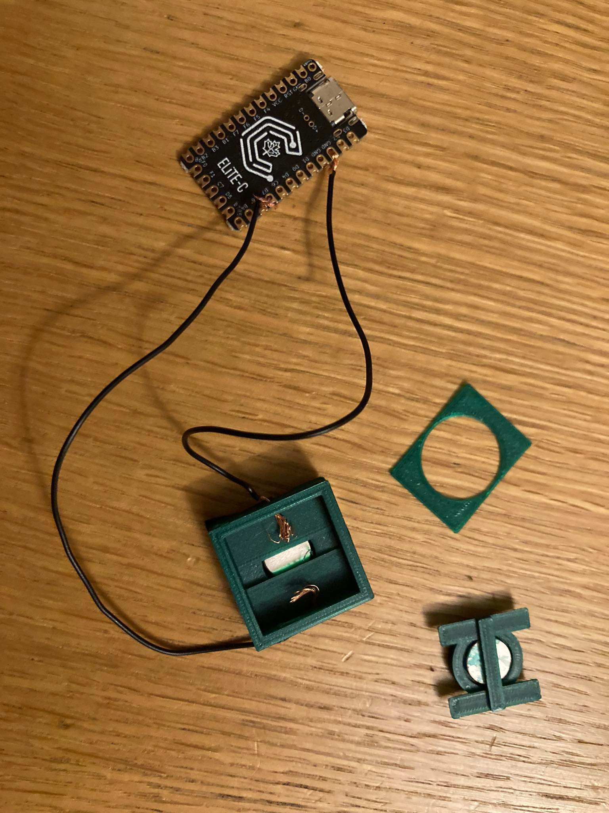

# Low Love keyboard

Here is my experiment in creating keyboard using magnets for
key switches. Process is very slow as I have many other
responsibilities so I am sharing all my progress in case someone
else will try to recreate it.

Ultimate goal is to create as low as possible keyboard.

I'm using OpenSCAD for creating models.

## v1

First version is complete failure as I have not made enough space
for tolerance and parts got stuck in each other. I have
overestimated capabilities of 3d printer.

## v2

Here I have added more tolerance and it is actually working.
Total height 10mm. I have used one magnet 1x10mm and another
2x10mm.

Here photo how it looks partially assembled:

Here is video how it looks in actions: https://www.youtube.com/shorts/CYt7auprm-o

Good things:

* I can make keyboard without soldering. That's actually cool.

* While not perfect it works.

Bad things:

* It does not feel nice because it is getting stuck a little bit.

* Sometimes key gets repeated more than once (something to
  figure out and understand why).

* 2x10mm magnets do not fit actually so my design is bad (oops).
  Glueing magnets most probably would be better idea.

* Weaker magnets most probably would be OK, e.g. 1x8mm.

* It is hard to add cover without breaking it. I have added cover
  for design only so that's not problem. It is just a note in case
  you will decide to print this version.
